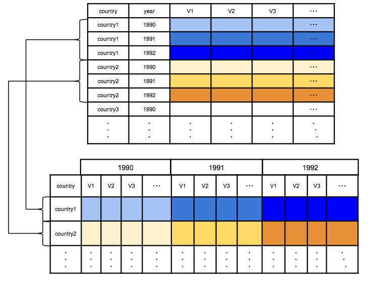

Dataset and code can be found at GitHub: <https://github.com/m-note/Replication/tree/master/caseMatch>    

## 1. How it works
caseMatchPD calculates the Mahalanobis distance of two vectors. For a given panel data that does not have any missing variables (the first table in Figure 1), caseMatchPD firstly makes vectors for each id (that is a country in Figure 1). Since panel data has timeseries for each id, caseMatchPD merges all years of a id into a single vector (the second table in Figure 1). Then, the distance between a pair of these new vectors are calculated in turn.
<div align="center">  
  
</div>  
  
<div style="text-align: center;">Figure 1: How caseMatchPD makes vectors</div>  
  

<span class="sample2" style="color:red">Is it possible to think as shown above for panel data?</span>

## 2. Preparation
#### dplyr is required for sorting
```{r warning=FALSE, results="hide", message=FALSE}
library(dplyr)
```

#### Load data
This dataset shows how much aid each recipient recieved in each year, and some relating variables to foreign aid.
```{r warning=FALSE}
data <- read.csv("PanelData_930.csv")
```
Data consists of 13 variables:  
- recipient: name of recipient country (128 countries)  
- year: 1991-2010 (20 years)   
- un_region: United Nations regional code  
- Aid_All: Total aid amount (logged)  
- p4_polity2: Polity IV score  
- fh_inverse_pr / fh_inverse_cl: freedom house score  
- Giniall: Gini coefficient scaled 0-100  
- Corruption: Corruption Perceptions Index  
- Rents: Total natural resources rents of GDP  
- Population: Total population (logged)  
- GDP: GDP per capita (constant 2005 US dollars, logged)   
- eu: EU membership in 2013
```{r warning=FALSE}
head(data)
```

## 3. Function
```{r warning=FALSE}
caseMatchPD <- function(data, id, year=1, dropvars=NA, returnNum=NA, method="mahalanobis", treatment=NULL){
  # data: dataset
  # id: id (ex. country name)
  # year: how many years are there for each country
  #       If the dataset is not panel data, year=1
  # dropvars: columns that are not used
  # returnNum: return number
  
  # drop dropvars
  if(is.na(dropvars[1])){}else{data <- data[, !(colnames(data) %in% dropvars)]}
  
  # unique id vector
  id_unique <- unique(data[,id])
  
  # If there is a treatment, divide dataset into one with treatment and one without
  if (!is.null(treatment)){
    ## Dataset with treatment 
    data_T <- data[data[, treatment]==1, ]
    data_T <- data_T[ , !(colnames(data_T) %in% treatment)]
    data_NT <- data[data[, treatment]==0, ]
    data_NT <- data_NT[ , !(colnames(data_NT) %in% treatment)]
  }
  
  # creating vectors
    for_time = 1
    result_list <- as.list(NULL) # initialize results list
    for (i in seq(1, nrow(data), year)){
      data_temp <- data[data[id]==as.character(id_unique[for_time]), # id matches
                        !(colnames(data) %in% c(id, treatment))]  # id is not needed for vector
      result_list <- append(result_list, list(as.vector(t(data_temp))))
      for_time = for_time + 1
    }
  if (!is.null(treatment)){
    ## Dataset with treatment
      for_time = 1
      id_unique_T <- unique(data_T[, id])
      result_list_T <- as.list(NULL) # initialize results list
      for (i in seq(1, nrow(data_T), year)){
        data_temp <- data_T[data_T[id]==as.character(id_unique_T[for_time]), # id matches
                          !(colnames(data_T) %in% id)]  # id is not needed for vector
        result_list_T <- append(result_list_T, list(as.vector(t(data_temp))))
        for_time = for_time + 1
      }
      ## Dataset without treatment
      for_time = 1
      id_unique_NT <- unique(data_NT[, id])
      result_list_NT <- as.list(NULL) # initialize results list
      for (i in seq(1, nrow(data_NT), year)){
        data_temp <- data_NT[data_NT[id]==as.character(id_unique_NT[for_time]), # id matches
                          !(colnames(data_NT) %in% id)]  # id is not needed for vector
        result_list_NT <- append(result_list_NT, list(as.vector(t(data_temp))))
        for_time = for_time + 1
      }
  }
  
  
  # for dataset without treatment / make combinations at first
  if (is.null(treatment)){
    combination <- as.data.frame(t(combn(seq(1, length(id_unique), 1), 2)))
    print(paste("Number of combinations:", nrow(combination)))
    combi_length <- nrow(combination)     
  }
  
  # calculation
  if (method=="cos"){
    # cos similarity
    result <- data.frame("id1" = NA, "id2" = NA, "similarity"=NA)
    for (s in 1:nrow(combination)){
      country1_num <- combination[s, 1]
      country2_num <- combination[s, 2]
      
      country1_vec <- unlist(result_list[country1_num])
      country2_vec <- unlist(result_list[country2_num])
      
      cos <- country1_vec %*% country2_vec / sqrt(country1_vec%*%country1_vec * country2_vec%*%country2_vec)
      
      result <- rbind.data.frame(result, 
            data.frame("id1" = id_unique[country1_num], "id2" = id_unique[country2_num], "similarity"=cos))
    }
    result <- result[2:nrow(result),]
    # sort by dplyr
    result <- result %>%
    dplyr::arrange(desc(similarity))
  }
  
  if(method=="euclid"){
    # euclidean distance
    result <- data.frame("id1" = NA, "id2" = NA, "distance"=NA)
    for (s in 1:nrow(combination)){
      id1_num <- combination[s, 1]
      id2_num <- combination[s, 2]
      
      id1_vec <- unlist(result_list[id1_num])
      id2_vec <- unlist(result_list[id2_num])
      
      euc <- sqrt(sum((id1_vec - id2_vec) ^ 2))
      result <- rbind.data.frame(result, 
            data.frame("id1" = id_unique[id1_num], "id2" = id_unique[id2_num], "distance"=euc))
    }
    result <- result[2:nrow(result),] # delete NA attached in initialization
    # sort by dplyr
    result <- result %>%
    dplyr::arrange(distance)
  }
 
  if(method=="mahalanobis" & is.null(treatment)){ # Datast without treatment
    result <- data.frame("id1" = NA, "id2" = NA, "distance"=NA)
    # the way to make variance-covariance matrix is different from year>1 and year=1
    if (year > 1){
      data_temp <- data[, !(colnames(data) %in% c(id, dropvars))]
      data_temp <- t(data.frame(result_list))
      rownames(data_temp) <- NULL
      covData <- cov(data_temp)
    }else{covData <- cov(data[, !(colnames(data) %in% c(id, dropvars))])}
    
    t<-proc.time() # check time
    for (s in 1:nrow(combination)){
      id1_num <- combination[s, 1]
      id2_num <- combination[s, 2]
      
      id1_vec <- unlist(result_list[id1_num])
      id2_vec <- unlist(result_list[id2_num])
      
      #print(paste("Processing", s, "out of", combi_length, "/", id_unique[id1_num], id_unique[id2_num]))
      maha <- mahalanobis(id1_vec, id2_vec, covData, tol=1e-50) # set tolalence http://goo.gl/hmmia0
      
      result <- rbind.data.frame(result, 
            data.frame("id1" = id_unique[id1_num], "id2" = id_unique[id2_num], "distance"=maha))
      
      if (maha < 0){
        print("Warning: Mahalanobis distance is negative value")
        break
      }
    }
    print(proc.time()-t) # time 
    result <- result[2:nrow(result),] # delete NA attached in initialization
    # sort by dplyr
    result <- result %>%
    dplyr::arrange(distance)
  }
  
  if(method=="mahalanobis" & !is.null(treatment)){ # Datast with treatment
    result <- data.frame("id1" = NA, "id2" = NA, "distance"=NA)
    # the way to make variance-covariance matrix is different from year>1 and year=1
    if (year > 1){
      data_temp <- t(data.frame(result_list))
      data_temp_T <- t(data.frame(result_list_T))
      data_temp_NT <- t(data.frame(result_list_NT))
      rownames(data_temp) <- NULL
      covData <- cov(data_temp)
      
      t<-proc.time() # check time
       for (i in 1:length(result_list_T)){
        treatment_vec <- unlist(result_list_T[i])
        
        for (s in 1:length(result_list_NT)){
          not_treatment_vec <- unlist(result_list_NT[s])
          
          maha <- mahalanobis(treatment_vec, not_treatment_vec, covData, tol=1e-50)
          
          result <- rbind.data.frame(result, 
                data.frame("id1" = id_unique_T[i], "id2" = id_unique_NT[s], "distance"=maha))
      }
    }
    print(proc.time()-t) # time 
    result <- result[2:nrow(result),] 
    # sort by dplyr
    result <- result %>%
    dplyr::arrange(distance)
    }else{ # year = 1
      covData <- cov(data[, !(colnames(data) %in% c(id, treatment))])
      
      t<-proc.time() # check time
      for (i in 1:length(result_list_T)){
      treatment_vec <- unlist(result_list_T[i])
      
        for (s in 1:length(result_list_NT)){
          not_treatment_vec <- unlist(result_list_NT[s])
          
          maha <- mahalanobis(treatment_vec, not_treatment_vec, covData, tol=1e-50)
          
          result <- rbind.data.frame(result, 
                data.frame("id1" = id_unique_T[i], "id2" = id_unique_NT[s], "distance"=maha))
        }
      }
    result <- result[2:nrow(result),] 
    print(proc.time()-t) # time
    # sort by dplyr
      result <- result %>%
      dplyr::arrange(distance)
    }
  }  
  
  if(is.na(returnNum)){
    return (result)
  }else{return (result[1:returnNum,])}
}
```


## 4. Analysis
### 4.1 Analysis 1
This new function, caseMatchPD can return the same results as caseMatch.  
caseMatch:  
```{r warning=FALSE, results="hide", message=FALSE}
library(caseMatch)
data(EU)
```
```{r warning=FALSE, results="hide", message=FALSE}
mvars <- c("socialist","rgdpc","FHc","FHp","trade")
dropvars <- c("countryname","population")
out <- case.match(data=EU, id.var="countryname", leaveout.vars=dropvars,
        distance="mahalanobis", case.N=2,
        number.of.matches.to.return=10,
        treatment.var="eu", max.variance=TRUE)
```
caseMatchPD:  
```{r warning=FALSE, results="hide", message=FALSE}
dropvars <- c("population")
out2 <- caseMatchPD(data=EU, id="countryname", year=1, dropvars=dropvars, method="mahalanobis", treatment="eu")
```
##### Results are the same as caseMatch
```{r warning=FALSE}
out$cases
```
```{r warning=FALSE}
out2[1:10,]
```

### 4.2 Analysis 2
In this analysis, treatment (eu) is not considered. So caseMatchPD simply finds the most similar cases.  

##### Set parameters
```{r warning=FALSE}
dropvars <- c("year", "Aid_All",
              "un_region",
              "eu",
              "GDP",
              "Population"
              ) 
id <- "recipient"
```
##### Run caseMatchPD
```{r warning=FALSE, results="hide", message=FALSE}
outcome <- caseMatchPD(data, id, year=20, dropvars=dropvars, method="mahalanobis")
```
```{r warning=FALSE}
outcome[1:15,]
```

### 4.3 Analysis 3
Treatment (whether joined eu or not) is now considered.  

##### Set parameters
```{r warning=FALSE}
dropvars_T <- c("year", "Aid_All",
              "un_region",
              "GDP",
              "Population"
              ) 
id <- "recipient"
```
##### Run caseMatchPD
```{r warning=FALSE, results="hide", message=FALSE}
outcome_T1 <- caseMatchPD(data, id, year=20, dropvars=dropvars_T, method="mahalanobis", treatment="eu")
```
```{r warning=FALSE}
outcome_T1[1:15,]
```
##### This setting returns negative Mahalanovis distance
```{r warning=FALSE}
dropvars_T <- c("year", "Aid_All",
              "un_region",
              "GDP"
              ) 
id <- "recipient"
```
```{r warning=FALSE, results="hide", message=FALSE}
outcome_T2 <- caseMatchPD(data, id, year=20, dropvars=dropvars_T, method="mahalanobis", treatment="eu")
```
```{r warning=FALSE}
outcome_T2[1:15,]
```
<span class="sample2" style="color:red">Is there any way to avoid negative values? Or is it possible to just ignore them and take positive values as results?</span>